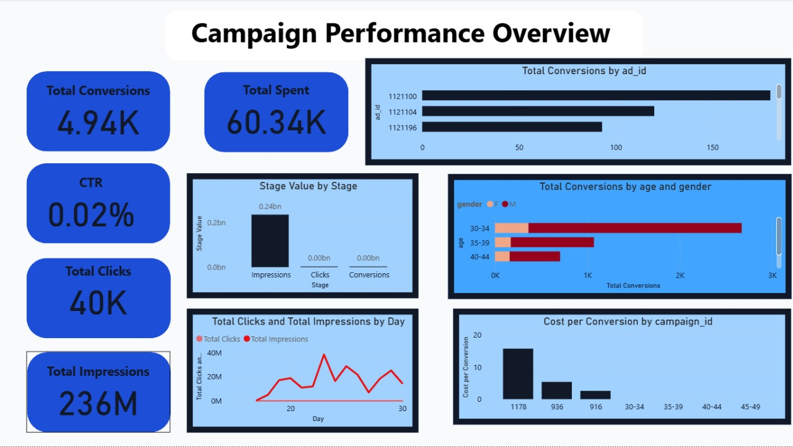

# Campaign Performance Dashboard -- Marketing Data

## 📌 Project Overview

This project analyzes marketing campaign performance data and builds an
interactive **Power BI dashboard**. The dashboard helps measure
advertising efficiency, audience engagement, and conversion performance
across campaigns.

## 📂 Files

-   **Dataset:** `data.csv` (campaign performance data)\
-   **Power BI file:** `task-2.pbix` -- Power BI dashboard file.\
-   **Screenshot:** `task.jpg` -- Visual preview of the dashboard.

## 📊 Dashboard Features

1.  **KPIs (Cards):**
    -   Total Conversions: **4.94K**\
    -   Total Spent: **60.34K**\
    -   CTR: **0.02%**\
    -   Total Clicks: **40K**\
    -   Total Impressions: **236M**
2.  **Visuals:**
    -   **Total Conversions by Ad ID** -- Horizontal bar chart showing
        conversion counts across ad IDs.\
    -   **Stage Value by Stage** -- Funnel stages (Impressions → Clicks
        → Conversions).\
    -   **Total Conversions by Age & Gender** -- Bar chart segmenting
        conversions by demographics.\
    -   **Total Clicks & Impressions by Day** -- Line chart tracking
        campaign activity over time.\
    -   **Cost per Conversion by Campaign ID** -- Bar chart evaluating
        cost-effectiveness per campaign.

## 📑 Dataset Description

The dataset (`data.csv`) includes campaign performance metrics with
fields such as:\
- **campaign_id** -- Unique identifier for the campaign\
- **ad_id** -- Identifier for individual ads\
- **date** -- Campaign activity date\
- **impressions** -- Number of times the ad was shown\
- **clicks** -- Number of clicks on the ad\
- **conversions** -- Number of successful conversions (leads/purchases)\
- **spent** -- Total ad spend (currency unit)\
- **age** -- Audience age group\
- **gender** -- Audience gender

## 🚀 How to Use

1.  Place all files (`data.csv`, `task-2.pbix`, `task.jpg`) in the same
    folder.\
2.  Open **Power BI Desktop**.\
3.  Load `task-2.pbix`.\
4.  If needed, refresh the data source connection to `data.csv`.\
5.  Explore the dashboard interactively by drilling down into KPIs,
    filters, and visuals.

## 📷 Dashboard Preview

